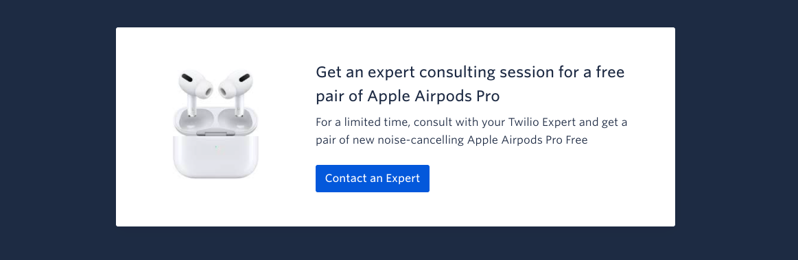
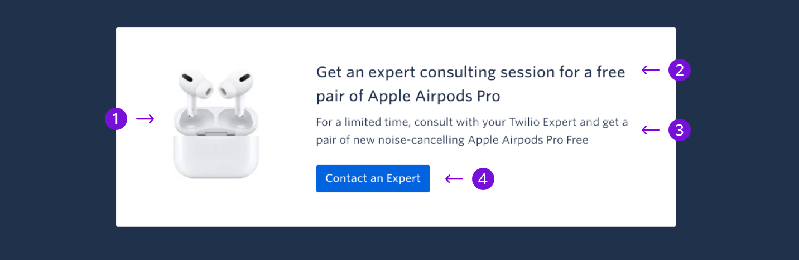

The Call Out block draws attention to information, such as a current promotion or campaign.



```
My Blocks / Call Out Block / Call Out
```

## Guidelines

### About Call Out

The Call Out block can appear anywhere below the hero and one other block. The background color can be changed to match the theme. When possible try to use images with a white background or a transparent background.

## Anatomy



|     | Name        | Limits                                    | Description                                                   |
| --- | ----------- | ----------------------------------------- | ------------------------------------------------------------- |
| 1   | Image       | Max Width: 195px <br /> Max Height: 195px | Image that relates to the highlighted information             |
| 2   | Title       | 86 characters <br /> (2 lines of text)    | Introduces the topic of the call out                          |
| 3   | Description | 122 characters <br /> (2 lines of text)   | Provides more details on the topic                            |
| 4   | CTA         | 26 characters <br /> (1 line of text)     | A CTA that connects user to more information on the call out. |
