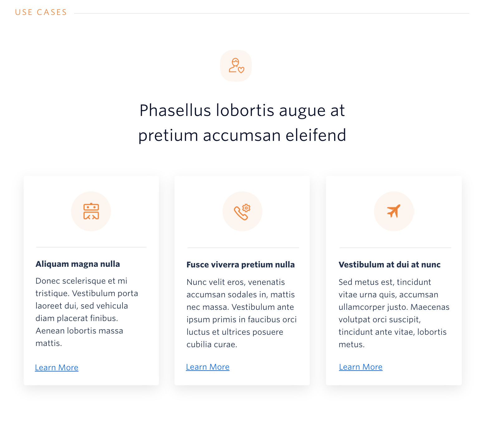
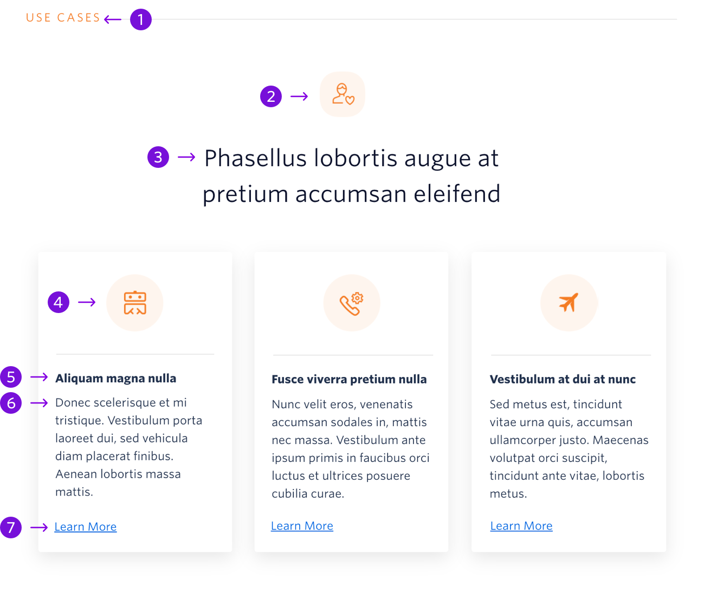

The Card List block provides the user with information about how a particular feature, product, or API can be used.



```
My Blocks / General Content / Card List
```

## Guidelines

### About Card List

The Card List block can be placed anywhere on the page below the hero. There should be 3 cards that introduce the user to 3 different examples. Each card should use a different circle icon that relates to the example on the card. All of the icons should be the same color and the color should match the color of the section heading. There is a list of valid colors and instructions on changing the color on the [How to Use Blocks](./how-to-use-blocks.mdx) page.

---

## Anatomy



|     | Name           | Limits                                  | Description                                                                     |
| --- | -------------- | --------------------------------------- | ------------------------------------------------------------------------------- |
| 1   | Section Header | 10 characters                           | General topic for the block, in most situations this should remain as Use Cases |
| 2   | Icon           | Max Width: 64px <br /> Max Height: 64px | A rounded square icon that relates to the content in this section               |
| 3   | Block Title    | 60 characters <br /> 2 lines of text    | An empowering statement that calls customers to build solutions                 |
| 4   | Card Icon      | Max Width: 80px <br /> Max Height: 80px | Circle icon that relates to the information on the card                         |
| 5   | Card Title     | 28 characters <br /> 1 line of text     | Title that relates to the content of the card, for instance a use case          |
| 6   | Description    | 170 characters <br /> 6 lines of text   | Provides more details on a topic such as the given use case                     |
| 7   | Link           | 30 characters <br /> 1 line of text     | Links to relevant content, such as examples on code exchange or docs            |
