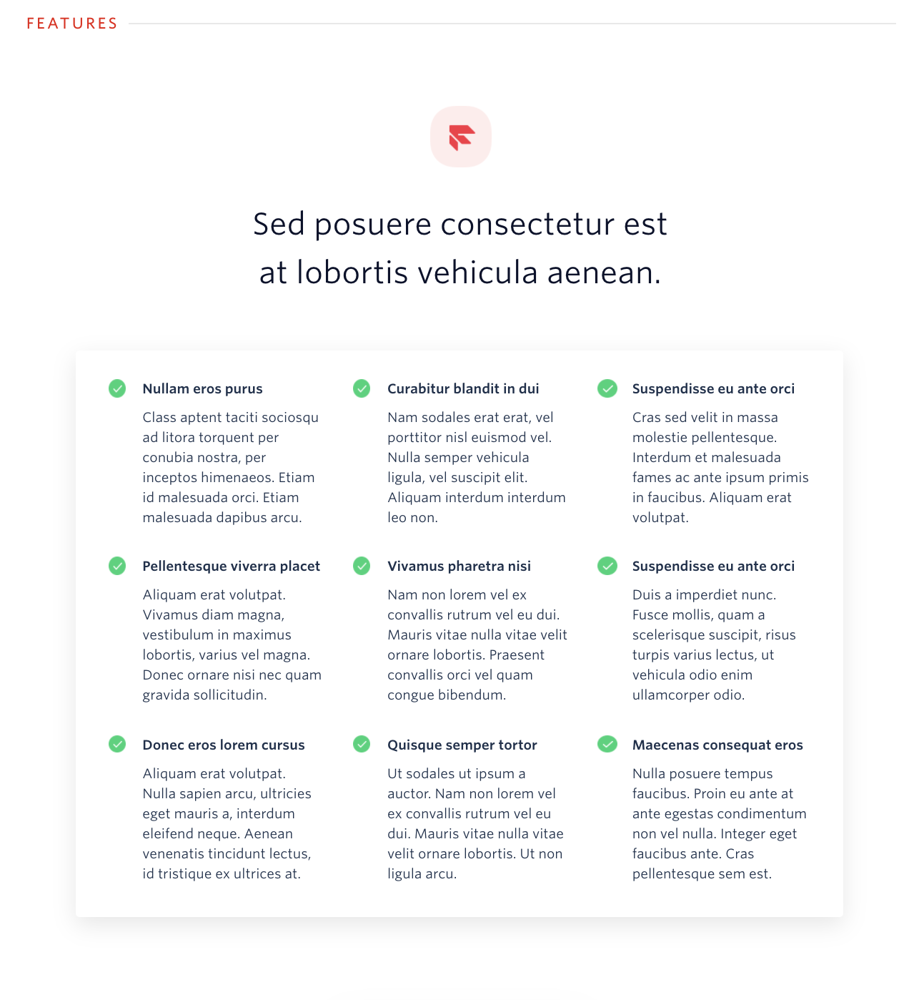
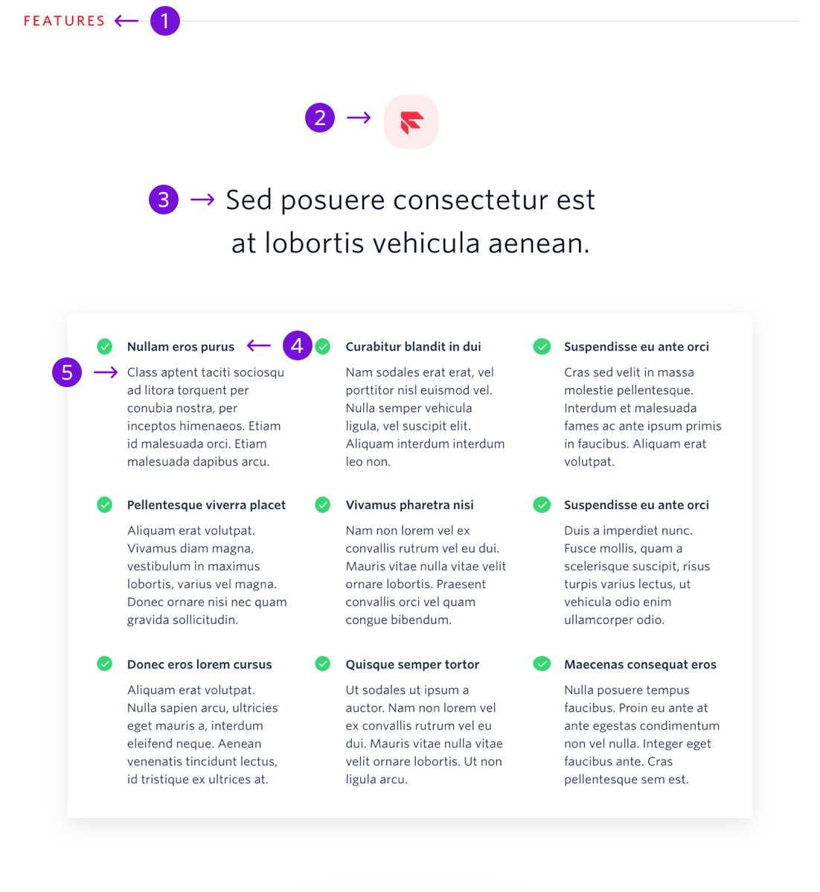

The features block gives the user detailed information about a list of features.



```
My Blocks / Product Details / Features (9 features)
My Blocks / Product Details / Features (6 features)
```

## Guidelines

## About Features

The features block can appear anywhere under the hero. This specific features block should be used when a description is desired for each feature. There is a features block with 6 features and features block with 9 features. A single feature can be deleted from the end of each of these blocks to make it 5 features or 8 features. Do not delete more than one feature and do not add additional features.

The icon at the top of the block should have a rounded background and the color of the icon should correspond to the section header color. There is a list of valid colors and instructions on changing the color on the [How to Use Blocks](./how-to-use-blocks.mdx) page.

---

## Anatomy



|     | Name                | Character Count                         | Description                                                                    |
| --- | ------------------- | --------------------------------------- | ------------------------------------------------------------------------------ |
| 1   | Section Header      | 10 characters                           | General topic for the block, in most situations this should remain as Features |
| 2   | Icon                | Max Width: 64px <br /> Max Height: 64px | A Rounded square icon that relates to the content in this section              |
| 3   | Block Title         | 60 characters <br /> 2 lines of text    | An empowering statement about the feature set                                  |
| 4   | Feature Title       | 22 characters <br /> 1 line of text     | Title that details a specific feature                                          |
| 5   | Feature Description | 140 characters <br /> 6 lines of text   | Description that briefly explains why a feature is valuable                    |
