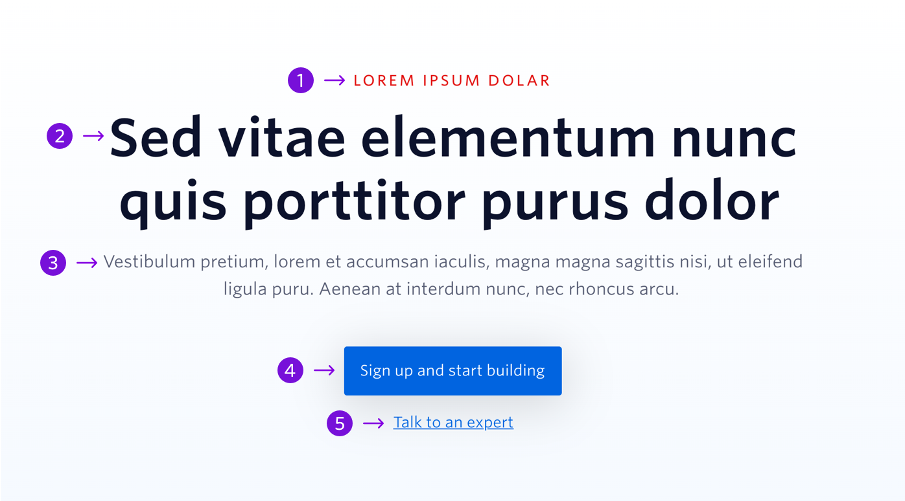

An oversized banner without an illustration at the top of a page that aims to grab the users attention and offer initial insight into Twilio


```
My Blocks / Top of Page / Hero without Illustration
```

## Guidelines

### About Hero without Illustration

The Hero block should be the first block on a page. The message the hero conveys needs to be put across simply and concisely to convey the product or service effectively. Each Hero section should contain a primary CTA that directs users to complete a desired action or to visit key content.

---

## Anatomy



|     | Name                     | Limits                                  | Description                                                                                                                                          |
| --- | ------------------------ | --------------------------------------- | ---------------------------------------------------------------------------------------------------------------------------------------------------- |
| 1   | Overline Heading         | 24 characters                           | Introduces the main topic of the page. For instance, product name.                                                                                   |
| 2   | Main Heading             | 40 characters <br /> (2 lines of text)  | An aspirational title that includes a product, industry, or persona                                                                                  |
| 3   | Description              | 160 characters <br /> (2 lines of text) | One to two sentence description of what a product does or how Twilio can help an industry or persona.                                                |
| 4   | Primary CTA              | 26 characters <br /> (1 line of text)   | A CTA that directs users down the ideal journey. The text should indicate to the user where they will be taken if they click on the CTA.             |
| 5   | Secondary CTA (optional) | 30 characters <br /> (1 line of text)   | A CTA that provides the users with another possible journey. The text should indicate to the user where they will be taken if they click on the CTA. |
