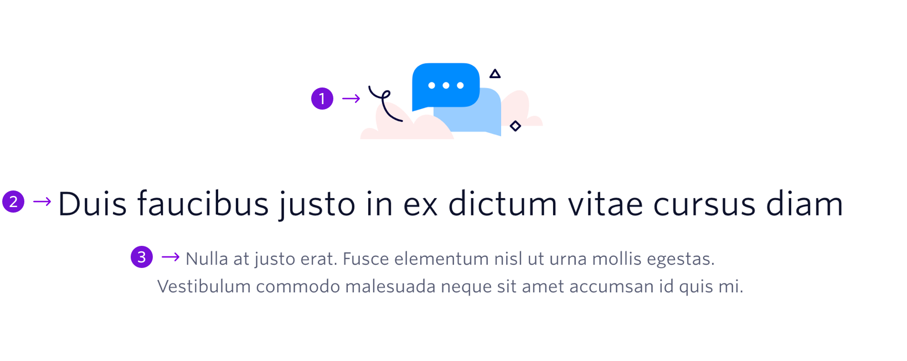

Provides users with further introductory information, such as the benefit of a product.


```
My Blocks / Top of Page / Intro
```

## Guidelines

### About Intro

The Intro block should be towards the top of the page, either directly under a Hero block or directly under the Logo Bar.

---



## Anatomy

|     | Name         | Character Count                          | Description                                                                             |
| --- | ------------ | ---------------------------------------- | --------------------------------------------------------------------------------------- |
| 1   | Illustration | Max Width: 200px <br /> Max Height: 85px | Small illustration that relates to page content. Be sure the illustration has alt text. |
| 2   | Heading      | 50 characters <br /> (1 line of text)    | Captures the benefit of a product or Twilio as a whole                                  |
| 3   | Description  | 130 characters <br /> (2 lines of text)  | More detailed information relating to the heading                                       |
