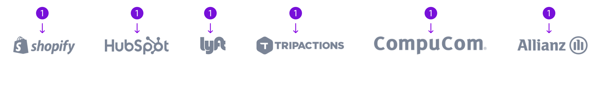

A logo bar adds social proof to a page and gives information to a user about what customers are using a particular product or service.

## Guidelines

### About Logo bar

The Logo Bar can appear anywhere on the page but in many cases it makes sense to have it right under a hero block or under a pricing block. The Logo Bar should only use approved customer logos and the logos should be relevant to the content of the page. All logos in the logo bar should be the lighter version of the logo. If you do not have a logo folder under images in your workspace be sure to follow the [instructions](./how-to-use-blocks.mdx) to add the logos.

There can be 4-6 logos in the logo bar. There is a separate block for 4 logos, 5 logos, and 6 logos. Be sure to use the logo bar that corresponds to the desired number of logos. All of the logos should be evenly spaced. Changing the logos can sometimes mess up the spacing. If this happens make sure there is 48px between each logo and that the logo bar is centered in the block.

---

## Anatomy

|     | Name | Character Count                          | Description                                                     |
| --- | ---- | ---------------------------------------- | --------------------------------------------------------------- |
| 1   | Logo | Max Width: 180px   Max Height: 29px | Customer logos that are relevant to the information on the page |
