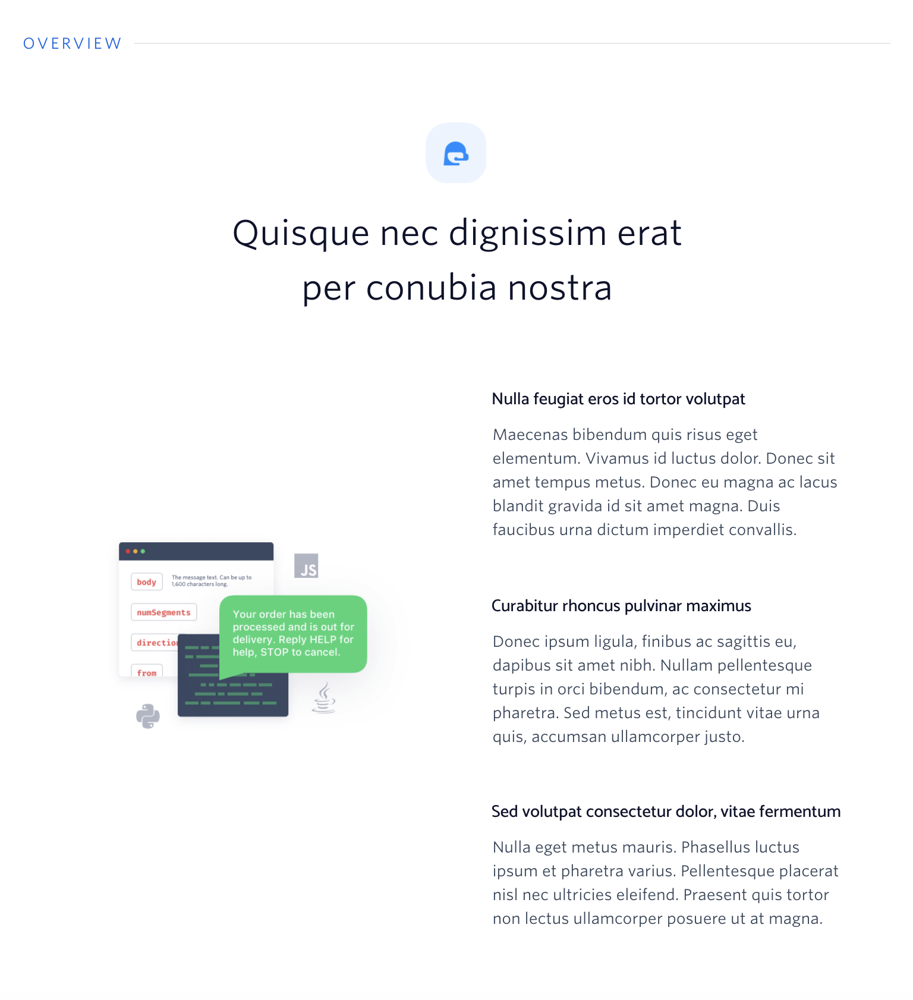
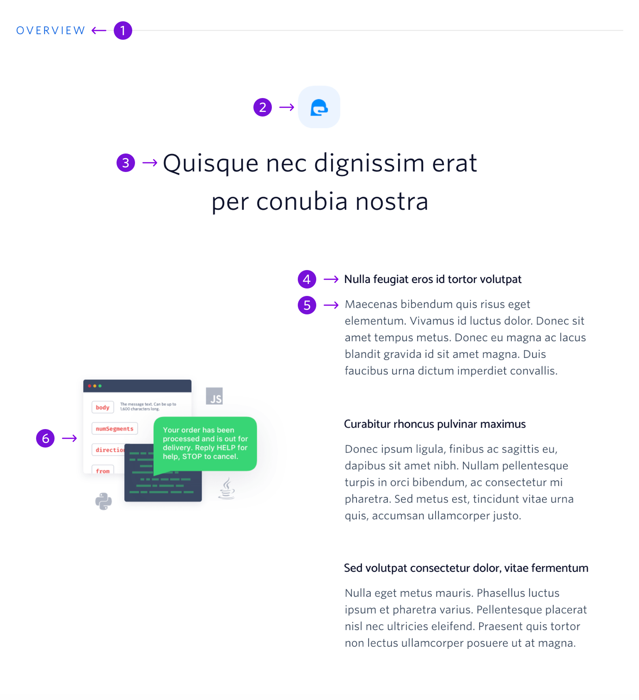

Dives into details that summarize the page or communicate the benefit of Twilio.

## Guidelines

### About Overview

The overview block can be placed anywhere on a page and is used to provide further details to a user. The icon at the top of the block should have a rounded background and the color of the icon should correspond to the section header color. There is a list of valid colors and instructions on changing the color on the [How to Use Blocks](./how-to-use-blocks.mdx) page.

---

|     | Name              | Character Count                           | Description                                                                               |
| --- | ----------------- | ----------------------------------------- | ----------------------------------------------------------------------------------------- |
| 1   | Section Heading   | 10 characters                             | General topic for the block, in most situations this should remain as Overview            |
| 2   | Icon              | Max Width: 64px   Max Height: 64px   | A rounded square icon that relates to the content in the section                          |
| 3   | Block Title       | 60 characters   (2 lines of text)    | Captures the top benefit or summarizes the page                                           |
| 4   | Paragraph Heading | 47 characters   (1 line of text)     | Highlights a detail                                                                       |
| 5   | Paragraph         | 220 characters   (5 lines of text)   | Expands on a detail                                                                       |
| 6   | Image             | Max Width: 368px   Max Height: 416px | The image should be related to the content in this section. For instance, a product shot. |
