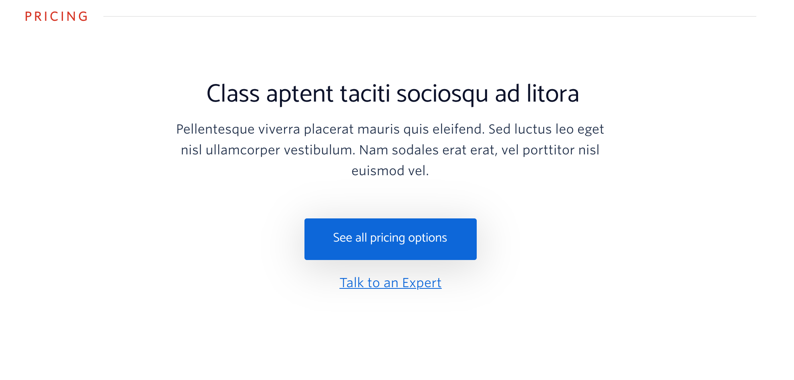
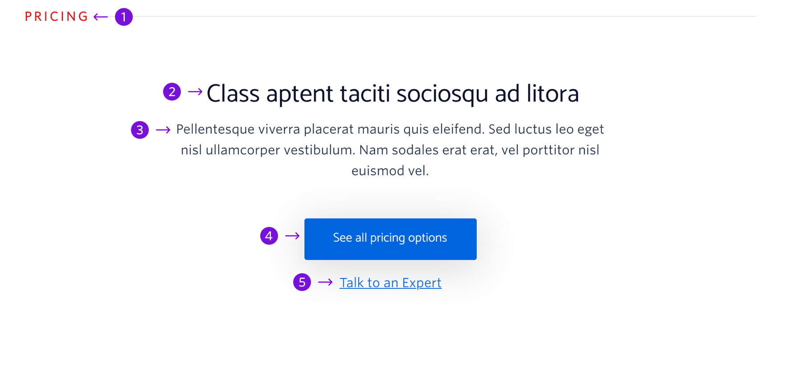

The Pricing block introduces users to the Twilio pricing model and links users to a relevant pricing page.



```
My Blocks / CTA / Pricing
```

## Guidelines

### About Pricing

This block should appear towards the bottom of the page. The CTAs should lead users to relevant pricing pages and should indicate to users where they will go if they click on the CTA.

---

## Anatomy



|     | Name                     | Limits                                  | Description                                                                                                                       |
| --- | ------------------------ | --------------------------------------- | --------------------------------------------------------------------------------------------------------------------------------- |
| 1   | Section Heading          | 10 characters                           | General topic for the block, in most situations this should remain as Pricing                                                     |
| 2   | Block Title              | 38 characters <br /> (1 line of text)   | Covers a broad benefit of the pricing model (e.g. “Flexible,” “Pay-as-you-go,” etc.)                                              |
| 3   | Description              | 190 characters <br /> (3 lines of text) | Short description that provides additional detail about our pricing model and how it delivers on the statement made in the title. |
| 4   | Primary CTA              | 26 characters <br /> (1 line of text)   | A CTA that takes the user to the appropriate pricing page                                                                         |
| 5   | Secondary CTA (optional) | 30 characters <br /> (1 line of text)   | A CTA that provides the users with another possible journey, in most cases this will remain as “Talk to an Expert”                |
