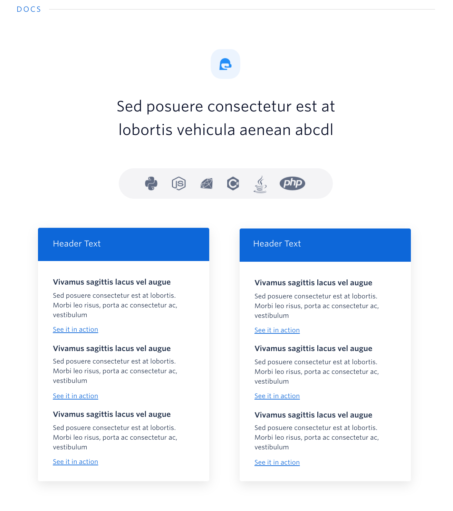
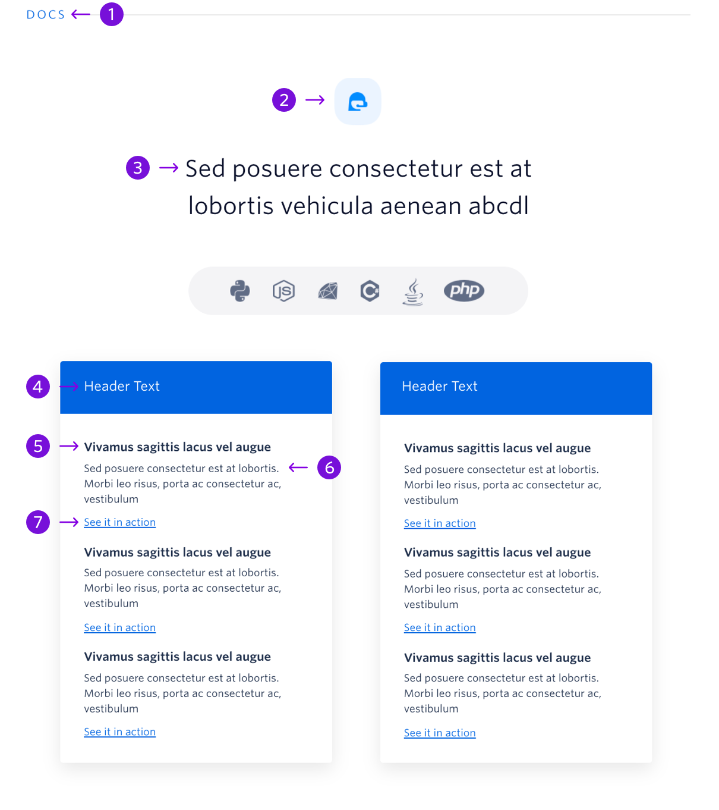

The technical resources block introduces the ease of using Twilio APIs to technical users.

## Guidelines

### About Technical Resources

The technical resources block is typically towards the top of a page and targets technical users. It should link out to docs or code examples that are relevant to the page. The block should always have 2 cards. The language bar should not change.

The icon at the top of the block should have a rounded background and the color of the icon should correspond to the section header color. There is a list of valid colors and instructions on changing the color on the [How to Use Blocks](./how-to-use-blocks.mdx) page.

---

## Anatomy

|     | Name            | Character Count                         | Description                                                                |
| --- | --------------- | --------------------------------------- | -------------------------------------------------------------------------- |
| 1   | Section Heading | 10 characters                           | General topic for the block, in most situations this should remain as Docs |
| 2   | Icon            | Max Width: 64px   Max Height: 64px | A rounded square icon that relates to the content in the section           |
| 3   | Block Heading   | 60 characters   (2 lines of text)  | Introduce that this block deals with technical content                     |
| 4   | Card Heading    | 32 characters   (1 line of text)   | Introduces an API                                                          |
| 5   | Example Heading | 36 characters   (1 line of text)   | Introduces users to a specific page in docs or a specific example          |
| 6   | Example Text    | 124 characters   (3 lines of text) | Dives into more details about the specific page in docs or the example     |
| 7   | Example Link    | 48 characters   (1 line of text)   | Link to the proper docs page or example                                    |
