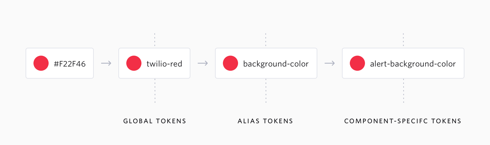

import { BigParagraph } from "../../src/gatsby-theme-docz/custom-components/big-paragraph";

# Introduction

<BigParagraph>
  Design tokens are tiny pieces of UI information that are used to ensure brand
  consistency and product design-engineer collaboration across all properties.
</BigParagraph>

⚠️ Design tokens and theming is still a work in progress. [Check out our roadmap!](../roadmap)

## Installation

Run the following command at the root of your project:

```
yarn add @twilio-labs/match-tokens
```

## How to use

To use Twilio design tokens, add an import in the file where you want to use the design tokens

```
import { TwilioDesignTokens } from "@twilio-labs/match-tokens";
```

Following the imports add the following line to create a new instance of the design tokens

```
const ds = new TwilioDesignTokens();
```

Now you can use the tokens by typing ds and continuing the dot notation with the token name and token value. For instance, `ds.breakpoint.small` or `ds.swatch.baseBlue.color`.

See the complete list of token names on the [tokens page](./tokens).

## Naming Convention

Every token name on Match starts with its related CSS property such as Fontweight and Breakpoint and is then followed by the token value.

- JavaScript: `breakpoint.small`
- CSS: `--breakpoint-small`
- SASS: `$breakpoint-small`

## Format

The preferred format for Match design tokens is: **JavaScript**. Other supported formats are: **SASS** and **CSS**.

## Types of Design Tokens



### Global Tokens

They are the primitive values in our design system and they are represented by context-agnostic names. Typography, color pallet, animation values are all stored as a global token.

### Alias Tokens

These tokens relate to a specific context or abstraction. Aliases helps us to communicate the intended purpose of the token and are much effective when a value with a single intent will appear in multiple places.

### Component-Specific Tokens

These type of tokens are an exhaustive representation of every value associated with a component. They often inherit from alias tokens, but are named in such a way that it allows engineering teams to be as specific as possible in applying token in development of the components.
