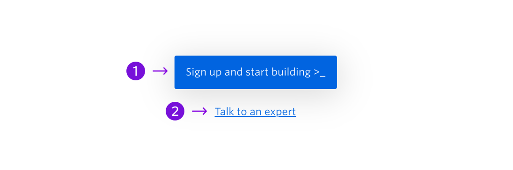

Final CTA on a page to drive traffic without making the user scroll back up to the top of the page.


```
My Blocks / CTA / CTA Section (with Secondary CTA)
My Blocks / CTA / CTA Section (Primary CTA only)
```

## Guidelines:

### About CTA Section

The CTA Section is typically the final block on a page. It will always include a Primary CTA, but the secondary CTA is optional. In Instapage there is a block with both the Primary CTA and the Secondary CTA and a block that only has a primary CTA. Both the primary and secondary CTA (if included) should start with a verb and should indicate where the user will be taken if they click on that CTA.

---

## Anatomy



|     | Name                     | Limits                              | Description                                                  |
| --- | ------------------------ | ----------------------------------- | ------------------------------------------------------------ |
| 1   | Primary CTA              | 26 characters <br /> 1 line of text | A CTA that directs users down the ideal journey.             |
| 2   | Secondary CTA (optional) | 30 characters <br /> 1 line of text | A CTA that provides the users with another possible journey. |
