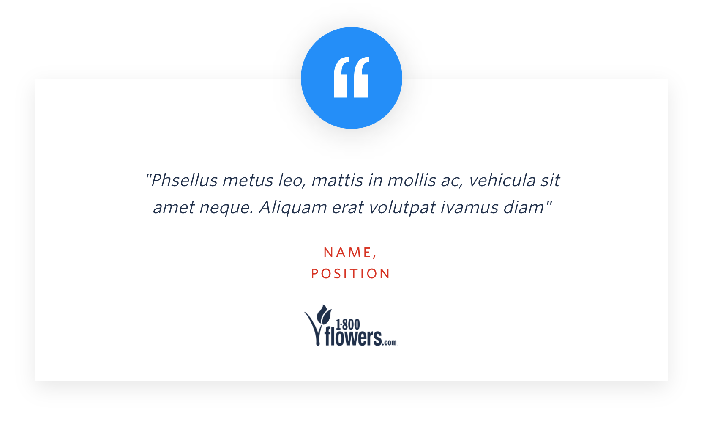
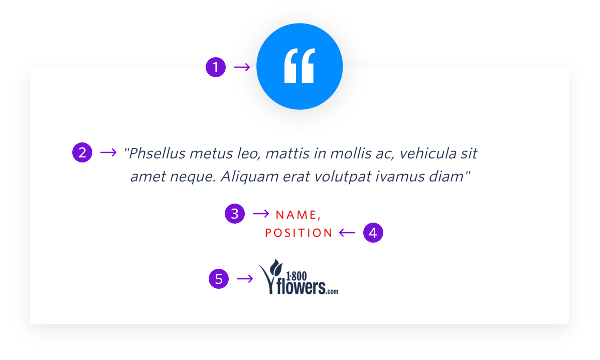

The customer quote increases credibility and trust in Twilio by sharing a customer’s perspective



```
My Blocks / Company Details / Customer Quote
```

## Guidelines:

### About Custoemr Quote

The customer quote can appear anywhere below the hero and one other block. The quote should further validate the content on the page. All customer quotes should include a logo of the customer’s company to build social credit.

---

## Anatomy



|     | Name              | Limits                                    | Description                                                                                              |
| --- | ----------------- | ----------------------------------------- | -------------------------------------------------------------------------------------------------------- |
| 1   | Customer Headshot | Max Width: 120px <br /> Max Height: 120px | Image of the customer. If there is not an image of the customer use the blue circle with quotation marks |
| 2   | Quote             | 100 characters <br /> 2 lines of text)    | Customer quote relating to the content of the page                                                       |
| 3   | Customer Name     | 50 characters <br /> 1 line of text       | Name of the customer                                                                                     |
| 4   | Customer Position | 50 characters <br /> 1 line of text       | Customer’s position                                                                                      |
| 5   | Customer Logo     | Max Width: 140px <br /> Max Height: 50px  | Dark version of the customer’s company logo                                                              |
