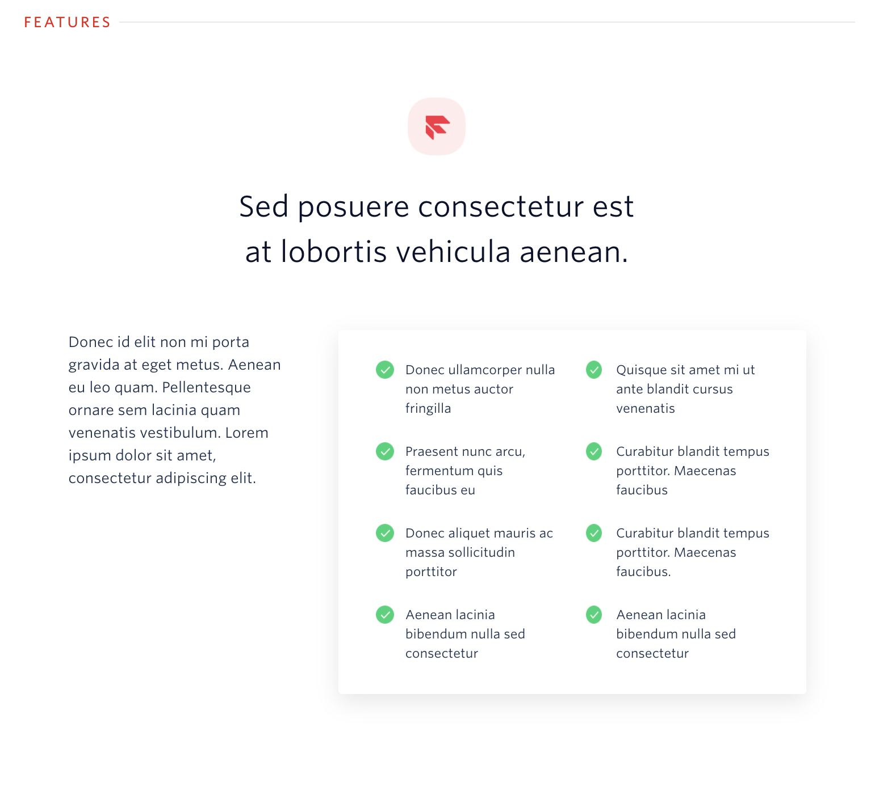
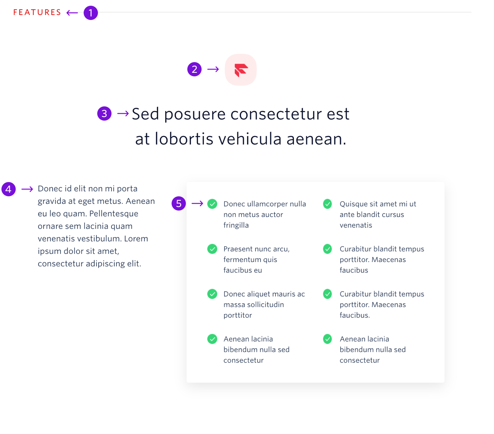

The Features with Paragraph block provides the user with information about a list of features and provides a supporting paragraph for the feature set.



```
My Blocks / Product Details / Features with Paragraph (4 features)
My Blocks / Product Details / Features with Paragraph (6 features)
My Blocks / Product Details / Features with Paragraph (8 features)
```

## Guidelines

### About Features with Paragraph

The Features with a Paragraph block can appear anywhere under the hero. There is a block for 4 features, 6 features and 8 features. No additional features should be added or taken away. This specific features block should be used when specific features do not need a description but there is additional information about the feature set.

The icon at the top of the block should have a rounded background and the color of the icon should correspond to the section header color. There is a list of valid colors and instructions on changing the color on the [How to Use Blocks](./how-to-use-blocks.mdx) page.

---

## Anatomy



|     | Name            | Limits                                  | Description                                                                              |
| --- | --------------- | --------------------------------------- | ---------------------------------------------------------------------------------------- |
| 1   | Section Heading | 10 characters                           | General topic for the block, in most situations this should remain as Features           |
| 2   | Icon            | Max Width: 64px <br /> Max Height: 64px | A rounded square that relates to the content in the section                              |
| 3   | Block Title     | 60 characters <br /> (2 lines of text)  | An empowering statement about the feature set                                            |
| 4   | Feature         | 54 characters <br /> (3 lines of text)  | A feature or brief statement about a feature                                             |
| 5   | Paragraph       | 190 characters <br /> (7 lines of text) | Supporting information for the feature set that demonstrates the power of these features |
