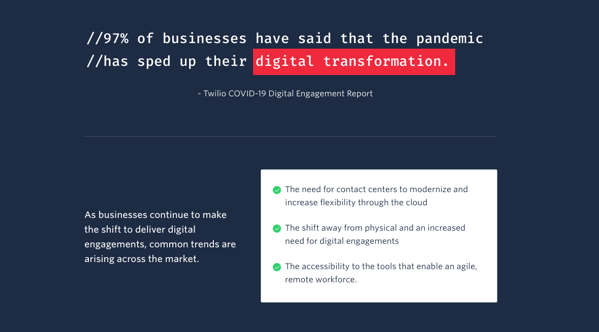
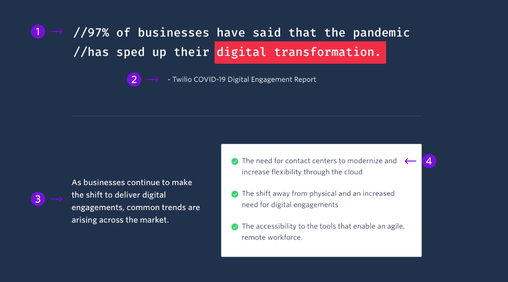

The ITTB Call Out draws attention to relevant information for the “It’s Time to Build Campaign”. The design of this block is specific for the campaign and thus should only be used to convey information for the campaign.



```
My Blocks / Call Out / ITTB Call Out
```

## Guidelines

### About Call Out

The ITTB Call Out can appear anywhere below the hero and one other block. It is branded for the “It’s Time to Build” campaign and should only be used for pages within that campaign.

## Anatomy



|     | Name        | Limits                                  | Description                                                                                                                                       |
| --- | ----------- | --------------------------------------- | ------------------------------------------------------------------------------------------------------------------------------------------------- |
| 1   | Title       | 95 characters <br /> (2 lines of text)  | Title of the call out. This can be a quote that is worth highlighting. Drag the red rectangle to highlight the most important words of the title. |
| 2   | Description | 100 characters <br /> (1 line of text)  | Additional information or an author if the title is a quote                                                                                       |
| 3   | Paragraph   | 120 characters <br /> (4 lines of text) | Provides more details on the call out and serves as an overview for the bullet points                                                             |
| 4   | CTA         | 100 characters <br /> (2 line2 of text) | Details that relate to the topic of the block                                                                                                     |
