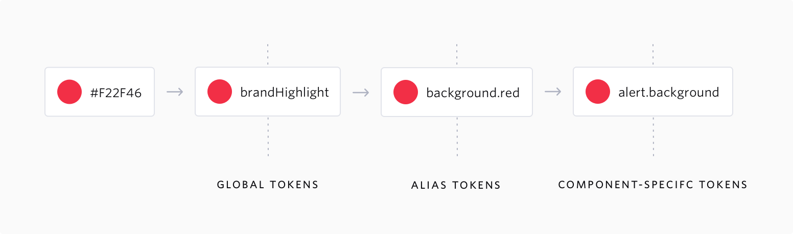

## Installation

Run the following command at the root of your project:

```
yarn add @twilio-labs/match
```

## How to use

To use Twilio design tokens, import the appropriate theme provider in the root of your React application.

```typescript
import * as React from "react";
import { TwilioTheme } from "@twilio-labs/match/themes";

const App: React.FC = ({ children }) => <TwilioTheme>{children}</TwilioTheme>;
export { App };
```

You can then access tokens within a styled component using the `theme` prop.

```typescript
const Component = styled.div`
  background: ${({ theme }) => theme.colors.brand};
  text-align: center;
`;
```

Or within a component using the `useTheme` hook.

```typescript
import * as React from "react";
import { useTheme } from "@twilio-labs/match/themes";

const Component: React.FC = () => {
  const theme = useTheme();
  return <div>{theme.mediaQueries.small}</div>;
};
```

Tokens are grouped into collections that may be accessed via dot notation. For instance, `theme.fontWeights.thin` or `theme.colors.baseBlue`.

Additionally, token names can be accessed with camelcase using the concatenated group and singular names. For instance, `theme.fontWeightThin` or `theme.colorBaseBlue`.

See the complete list of token names on the [tokens page](./tokens.mdx).

## Naming Convention

Every token name on Match starts with its related CSS property such as Font Weight and Media Query and is then followed by the token value.

- JavaScript: `fontWeights.thin` or `fontWeightThin`
- CSS: `--font-weight-thin`
- SASS: `$font-weigh-thin`

## Format

The preferred format for Match design tokens is: **JavaScript**. Other supported formats are: **SASS** and **CSS**.

## Types of Design Tokens



### Global Tokens

They are the primitive values in our design system and they are represented by context-agnostic names. Typography, color pallet, animation values are all stored as a global token.

### Alias Tokens

These tokens relate to a specific context or abstraction. Aliases helps us to communicate the intended purpose of the token and are much effective when a value with a single intent will appear in multiple places.

### Component-Specific Tokens

These type of tokens are an exhaustive representation of every value associated with a component. They often inherit from alias tokens, but are named in such a way that it allows engineering teams to be as specific as possible in applying token in development of the components.
