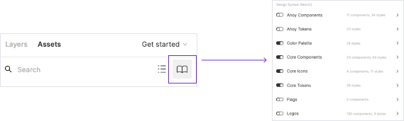

## Get Figma Libraries

Reach out to your manager to request a Twilio Figma account.

### Match libraries

To turn on Match libraries, select “Libraries” from the menu in your project. Toggle on libraries you want to use. We recommend toggling on all libraries for the theme you’re working in (so tokens, icons, components, and probably color palette).

Once enabled, you can drag and drop components from the assets panel on the left. Tokens can be added as text styles, color styles, or effects in the Design panel on the right.

## Brand Library access

1. Submit an [IT ServiceNow ticket](https://twilio.service-now.com/) (or access ServiceNow through Okta)
2. Submit a Request > Application Access Request
3. Choose “The Library (Bynder)” and submit your request
